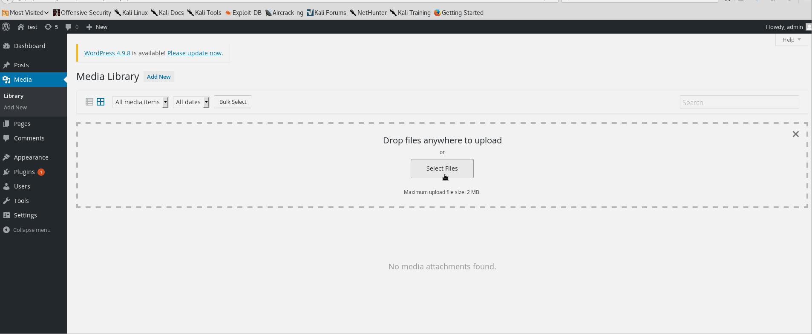
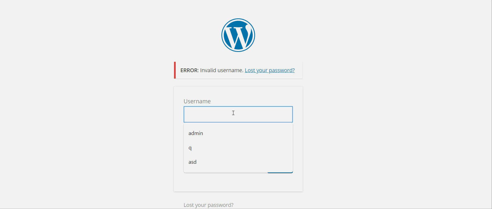

# Project 7 - WordPress Pentesting

Time spent: **X** hours spent in total

> Objective: Find, analyze, recreate, and document **five vulnerabilities** affecting an old version of WordPress

## Pentesting Report

### 1. (Required) Authenticated Cross-Site Scripting (XSS) via Media File Metadata
  - [x] Summary: Meta information (ID3) stored in audio files are not properly sanitized and no output encoding is used on the meta information which can be vulnerable to XSS.
    - Vulnerability types: XSS
    - Tested in version: 4.2
    - Fixed in version: 4.2.13
  - [x] GIF Walkthrough: 
  - [x] Steps to recreate:
    - Upload the MP3 file to the Media Library.
    - Viewing attachment page or commenting will result in a XSS alert.
  - [x] Affected source code:
    - [Media function](https://core.trac.wordpress.org/browser/branches/4.2/src/wp-admin/includes/media.php)
### 2. (Required) User Enumeration
  - [x] Summary: Different messages are shown for invalid usernames and valid usernames with incorrect passwords which can lead to user enumeration.
    - Vulnerability types: User Enumeration
    - Tested in version: 4.2
    - Fixed in version: N/A
  - [x] GIF Walkthrough: 
  - [x] Steps to recreate:
    - Type in "admin" as username with incorrect password shows password is incorrect.
    - Type in "random" as username with incorrect password shows invalid username.
  - [x] Affected source code:
    - [Login function](https://core.trac.wordpress.org/browser/tags/4.2/src/wp-login.php)
### 3. (Required) Authenticated Stored Cross-Site Scripting (XSS) in YouTube URL Embeds
  - [x] Summary: XSS vulnerability found in an embed shortcode function. An embed URL is passed to a function called autoembed(). This function contains several regular expressions, and if none of them matches the embed URL it simply returns it. A XSS script can be crafted to bypass the regular expressions to get executed.
    - Vulnerability types: XSS
    - Tested in version: 4.2
    - Fixed in version: 4.2.13
  - [x] GIF Walkthrough: 
  - [x] Steps to recreate:
    - Create a post using the following script:
      `[embed src='https://youtube.com/embed/12345\x3csvg onload=alert(document.cookie)\x3e'][/embed]`
    - Users who view the post will have the script executed.
  - [x] Affected source code:
    - [Autoembed function](https://core.trac.wordpress.org/browser/trunk/src/wp-includes/class-wp-embed.php)
### 4. (Optional) Large File Upload Error XSS
  - [x] Summary: A malicious script is injected into the filename of a 20MB png file. Maximum upload file size is 2 MB and upon uploading a file of size greater than 2 MB, an error will be shown and a script can be executed.
    - Vulnerability types: XSS
    - Tested in version: 4.2
    - Fixed in version: 4.2.15
  - [x] GIF Walkthrough: 
  - [x] Steps to recreate:
    - Create a 20 MB file with name:
      	Dinosaurs secret life.png
    - Upload as a new media file and on error the screen will execute alert(1).
  - [x] Affected source code:
    - [Script-Loader function](https://core.trac.wordpress.org/browser/trunk/src/wp-includes/script-loader.php)
### 5. (Optional) Vulnerability Name or ID
  - [ ] Summary:
    - Vulnerability types:
    - Tested in version:
    - Fixed in version:
  - [ ] GIF Walkthrough:
  - [ ] Steps to recreate:
  - [ ] Affected source code:
    - [Link 1](https://core.trac.wordpress.org/browser/tags/version/src/source_file.php)

## Assets

List any additional assets, such as scripts or files

## Resources

- [WordPress Source Browser](https://core.trac.wordpress.org/browser/)
- [WordPress Developer Reference](https://developer.wordpress.org/reference/)

GIFs created with [LiceCap](http://www.cockos.com/licecap/).

## Notes

Describe any challenges encountered while doing the work

## License

    Copyright [yyyy] [name of copyright owner]

    Licensed under the Apache License, Version 2.0 (the "License");
    you may not use this file except in compliance with the License.
    You may obtain a copy of the License at

        http://www.apache.org/licenses/LICENSE-2.0

    Unless required by applicable law or agreed to in writing, software
    distributed under the License is distributed on an "AS IS" BASIS,
    WITHOUT WARRANTIES OR CONDITIONS OF ANY KIND, either express or implied.
    See the License for the specific language governing permissions and
    limitations under the License.
